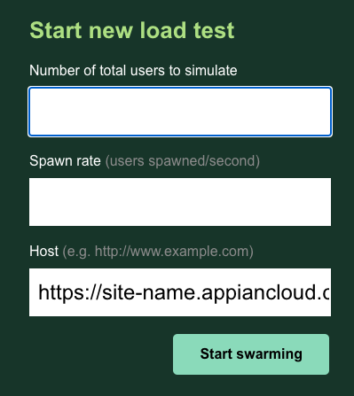

.. _ways_of_running_locust:

#################
How to Run Locust
#################

Once you have the library installed, you can simply follow the output from running ``locust -h`` to run your test.
Note that if you don't specify a locustfile with ``-f FILE_NAME``, locust will look for a file called locustfile in the current directory by default.

Command Line Flow (recommended)
************************************

If you’re running Locust somewhere where there is no web ui, or you don’t want to bother with the web flow, I tend to run Locust like so:

.. code-block:: bash

    locust -f tests/example_locustfile.py -u 1 -r 10 -t 3600 --headless

.. _command_line_flow_args:

Required Arguments
------------------------------------
This is the bare minimum to run a Locust test without the web view. You’ll notice you need to specify:

- The hatch rate (-r is for rate)
- The number of users (-u is for users)
- The time of the test (-t) in seconds
- The --headless flag

Once you run this command, the test will start immediately, and start logging output. It should run for the duration you run the test, and hitting ctrl+c may orphan some locusts. Some arguments that we use are

- --csv-full-history -> prints out the different percentile changes every 30 seconds

It's recommended to capture log file output when running Locust as well, i.e. ``| tee run.log``

Web Flow
************

If you supply no arguments to ``locust`` other than the locustfile, Locust will launch in a web mode. This is not recommended, mainly because you can’t automate running it as it requires manual interaction as well as access to the flask application.

``locust -f example_locustfile.py``

If you navigate to http://localhost:8089/ you’ll see the following:

These arguments map to the same arguments described in the :ref:`command_line_flow_args` section.

Once you hit "start swarming", you’ll see graphs reporting latencies, errors, and other data. These can be useful for visually understanding how a load test is performing.
